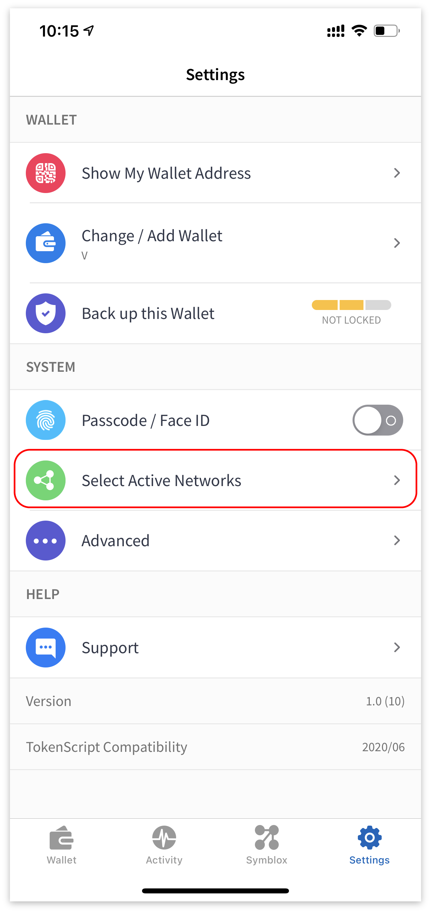

# Cross-chain Guide for Mobile

##### Installing Velas Defi Wallet  
Download the Velas DeFi Wallet at https://symblox.io.  
You can check guides for mobile <a href="https://symblox.github.io/guides/yield-farming/2020/10/22/symblox-guide-for-mobile" target="_blank">here</a>.  
You can check guides for PC <a href="https://symblox.github.io/guides/yield-farming/2020/10/22/symblox-guide-for-pc" target="_blank">here</a>. 

--- 
# Configuring Velas Defi Wallet  

Adding Ethereum Network.
  
 
  
Click on 'Settings' tab, then choose "Select Active Networks"  

  

Choose 'Ethereum' then click 'Save'.  

  

Adding USDT token contract for Ethereum and Velas.
  
 
  
Click on the 'Wallet' tab, then click on 'Add/Hide Tokens'.

  

Click the '+' sign.  

  

Paste the following address in the 'Contract Address' field to add USDT token on Ethereum. The other fields will autofill when you paste the address.  
USDT on Ethereum: **0xdAC17F958D2ee523a2206206994597C13D831ec7**  

  

Repeat the process to add USDT on Velas.  
USDT on Velas: **0x4b773e1ae1baa4894e51cc1d1faf485c91b1012f**  

  

If you haven't added SYX token yet, you can repeat the previous process to add SYX.  
SYX Token Address: **0x2de7063fe77aAFB5b401d65E5A108649Ec577170**  

    

Adding WETH token contract for Ethereum and Velas.
  
 
  
Click on the 'Wallet' tab, then click on 'Add/Hide Tokens'.

  

Click the '+' sign.  

  

Paste the following address in the 'Contract Address' field to add WETH token on Ethereum. The other fields will autofill when you paste the address.  
WETH on Ethereum: **0xc02aaa39b223fe8d0a0e5c4f27ead9083c756cc2**  

  

Repeat the process to add WETH on Velas:  
**V67RMNXTgYKi9CsmrSXvFfLAiubfWB5p34**  

  

    

 
# Using TokenBridge  

Transferring USDT on Ethereum to Velas blockchain.
  
 
  
Click 'Symblox' tab, then goto homepage: <a href="https://symblox.io/" target="_blank">https://symblox.io/</a>  
Click 'Open Cross-chain' button or type in the address field:  
<a href="https://x.symblox.io/" target="_blank">https://x.symblox.io/</a>  

  

(1) Click the menu button.  
(2) If 'Ethereum' isn't already chosen, click the 'Connected to:' to choose the Ethereum Network.  

  

Choose 'Ethereum'.  

  

Click 'Connect Wallet'.  

  

>The first time you use the cross-chain, the smart contract will require permission before accessing your wallet. Therefore it requires you to *unlock* before transferring.   

Enter amount to transfer then click 'Unlock'.  

  

Click 'Confirm' to send or click 'Edit' to manually change the gas fees.  

  

>Due to heavy congestion on the Ethereum network, transactions could take a long time or get stuck. If you've waited for a sufficient period of time and is still at the 'Loading...' screen, try reloading the webpage to see if your transaction has cleared.  

  

After you have 'Unlocked', click 'Transfer'.  

  

Verify your transfer amount then click 'Continue'.  

  

After transfer, you can check your 'Balance' to see the amount transferred.  

  

Transferring USDT from Velas back to the Ethereum blockchain.

 

(1) Click the menu button.  
(2) If you're not connected to Velas already, click 'Connected to:' to change your current network.  

  

Choose 'Velas'.  

  

Enter the amount to send then click 'Transfer'.  

  

Verify the amount then click 'Continue'.  

  

  

Transferring WETH on Ethereum to Velas blockchain.
  
 

Within DeFi Wallet app, go to homepage. Then click the 'Open Cross-chain' button.  

1. Click on the menu.  
2. Click 'Connected to:'  

  

Click on 'Ethereum'.  

  

1. Click 'Connect Wallet'.
2. Click 'Wrap/Unwrap ETH' to load Kyber widget.  

  

Enter amount to transfer then checkbox agreement. Click 'Next' to continue.  

  

>Note*** Make sure to have enough ETH reserved to pay for transaction fees.  

Verify the amount to be swapped then click 'CONFIRM'.  

  

Click 'CONFIRM' to finish transaction, or click 'Edit' to change gas fees.  

  

You can optionally increase the fee to reduce wait time.  

  

Once confirmed and broadcasted, a transaction id is created.  

  

From the cross-chain screen:
1. Click on the drop-down list.   
2. Choose WETH from the list.  

  

1. Enter the amount of WETH to transfer across the bridge.  
2. Click 'Unlock' to allow the smart-contract permission to interact with your wallet.  

  

>Note*** Due to heavy traffic on Ethereum, it is advised to increase the gas fees to improve wait times.  

Click 'Confirm' to finish or click 'Edit' to change gas fees.  

  

Depending on network traffic, the transaction could take a few minutes to confirm. If it is stuck on the 'Loading...' screen for over a few minutes, you can reload the page to verify if its unlocked. It is advised that you increase the gas fee to average or fast to improve wait time.  

  

Once it is unlocked:  
1. Enter the amount of WETH you would like to transfer to Velas blockchain.  
2. Click 'Transfer' to continue.  

  

Confirm the transaction then click 'OK' to continue.  

  

Click 'Confirm' to finish or 'Edit' to change gas fees.  

  

 

  

Transferring WETH on Velas back to Ethereum blockchain.
  
 

From the cross-chain page:  
1. Click on the menu.  
2. Click on 'Connected to:'  

  

Choose the Velas network.  

  

Click 'Connect Wallet' then click on the drop-down list and choose 'WETH'.    

  

1. Enter amount of WETH to be transferred back to the Ethereum network.  
2. Click 'Transfer' to continue.  

  

Confirm transaction and click 'OK' to continue.  

  

Wait for the transaction to be confirmed. You can also click on the transaction id to track the progress.  

  

1. Click the menu.  
2. Click 'Connected to:'.  

  

Choose the Ethereum network.  

  

Click on 'Wrap/Unwrap ETH' to load the Kyber widget.  

  

Click the 'Swap' button so that the 'From Token' is WETH.  

  

Enter amount of WETH to be converted to ETH. Checkbox the agreement and click 'Next'.  

  

Verify transaction then click 'APPROVE' to continue.  

  

Click 'Confirm' to finish or 'Edit' to change the gas price.  

  

Click 'CONFIRM' to finish transaction.  

  

 

  
